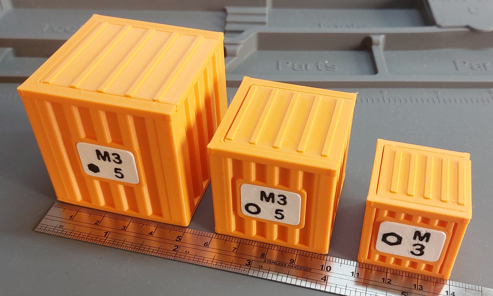
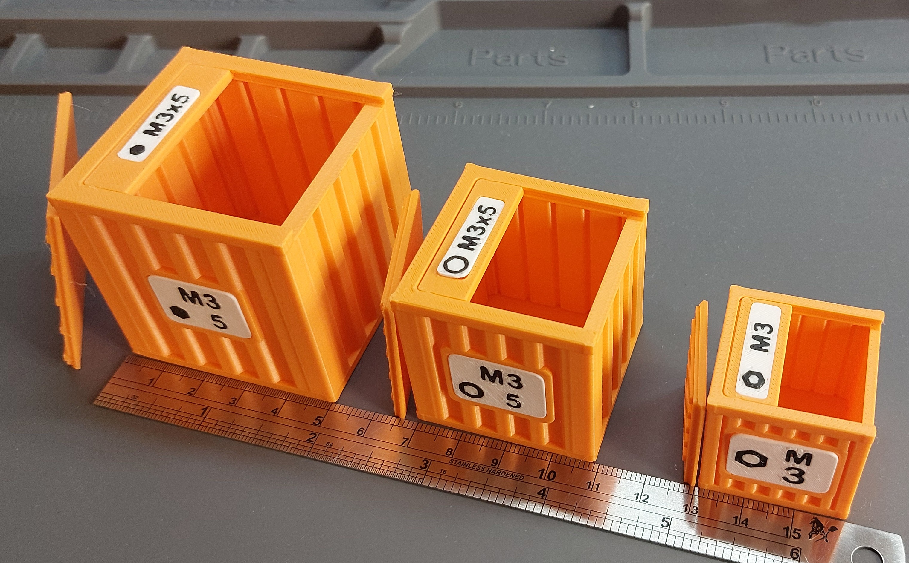
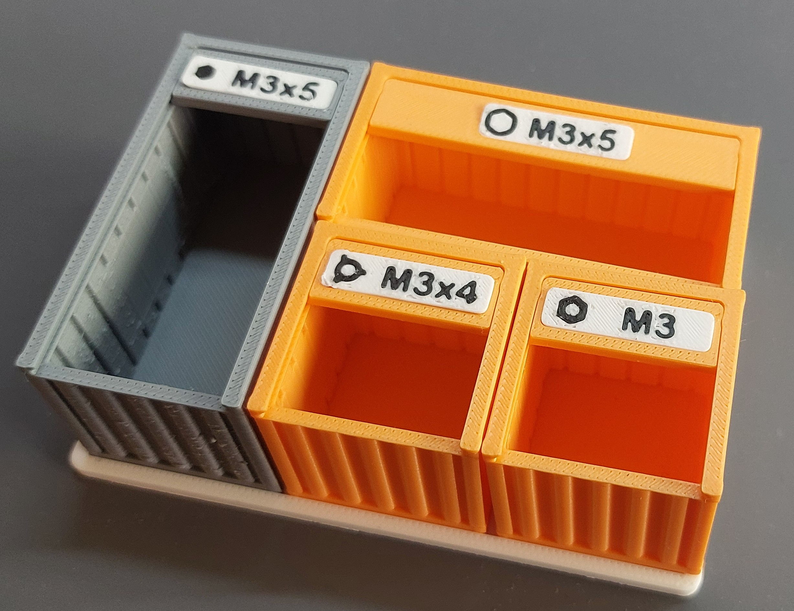
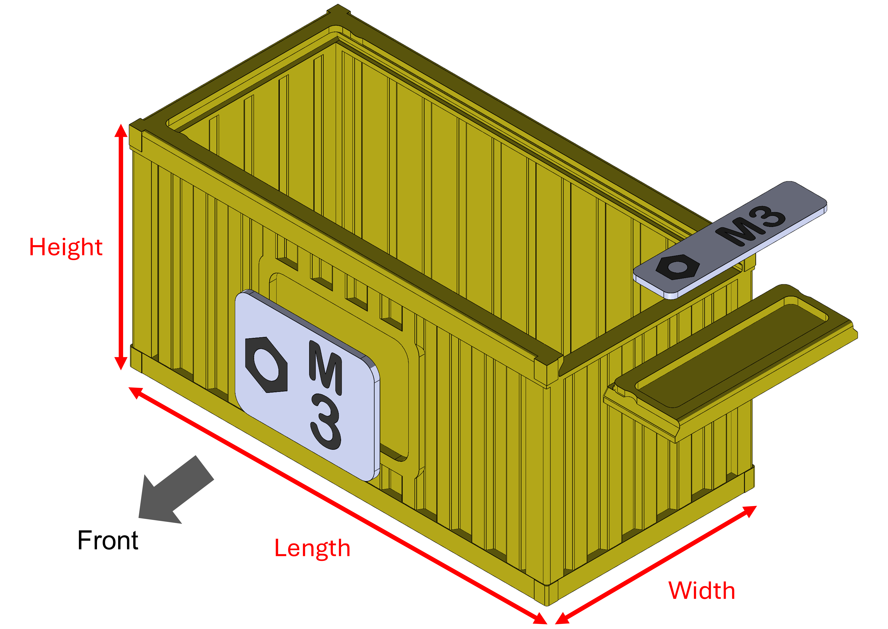
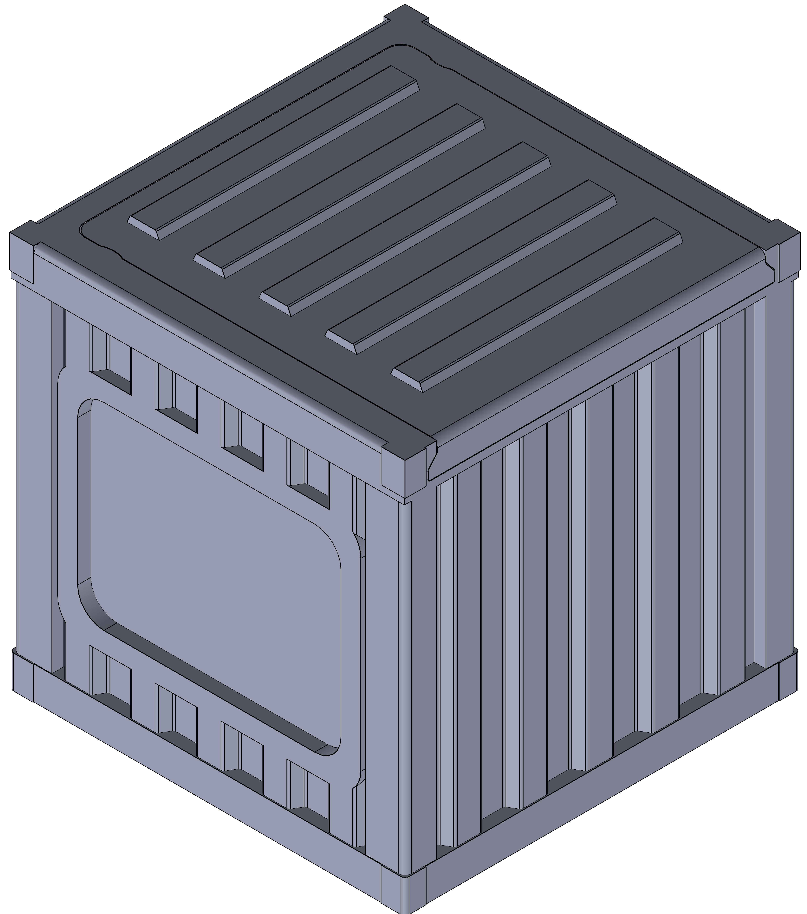
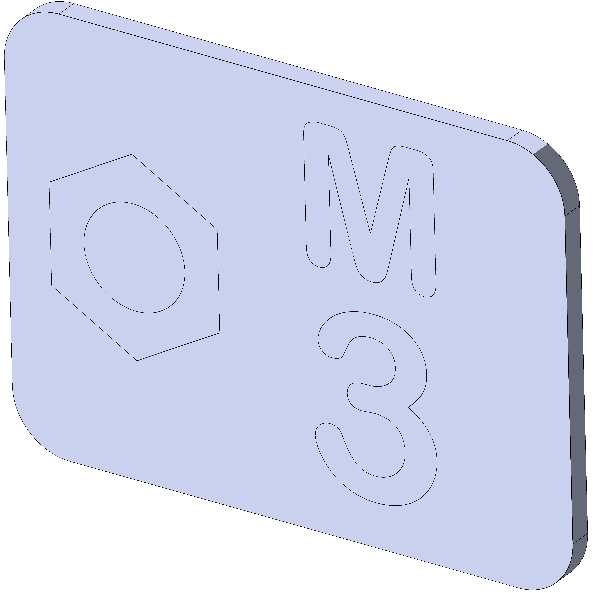
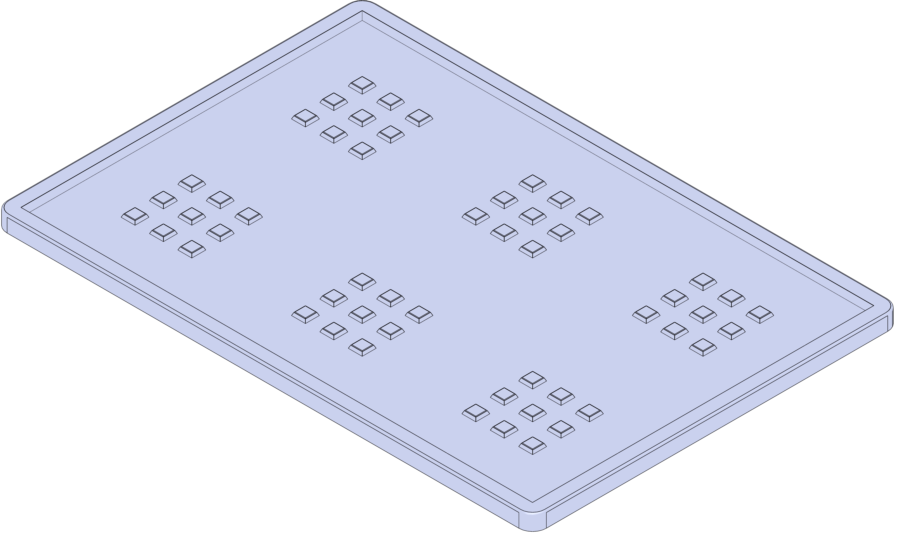

# Shipping Container Style Screw Storage
[English version](./README.md) | [中文版](./README_ch.md)
Lid | Label lid
:----:|:----:
 | 

## Introduction
The design is built using one main measurement called the "base_length" (**30mm, 40mm, 50mm**). The height, length, and width are set as the multiples of this "base_length". For example, a 30mm h1xL3xW2 container will be 30mm tall, 90mm long, and 60mm wide.

Every container comes with its own lid and label. The repository offers hundreds of labels to choose from.

## Features: Two Formats
Stackability | Flat in a tray
:-------:|:--------:
 | 

 The design is stackable within the same "base_length".
 
 If you don't want the lid and the stackability, and alternative options is to print a top label without a lid and put containers on a tray. Trays also come with different dimensions.

## Who Might Be Intersted
+ You need screws/parts storage. 
+ When you only have a few variations of parts but don’t want to print a super large case.
+ You want individual containers that can be enclosed and carried around without a huge case.
+ You don’t want to create labels manually yourself for common part types. Just choose from the files I generated.
+ You want (over) sturdy part containers.
+ You like shipping container style.

## Variations
For each "base_length" (30mm, 40mm, 50mm), the container has different multiple in each direction. The height grid can be 1~2, length grid can be 1~3, and width grid can be 1~3.

Containers have file name of {base_length}_h{height_grid}_L{length_grid}_W{width_grid}.

In the figure above, the container should have file name of "container_xxmm_h1_L2_W3.stl"

For example [container_30mm_h1xL3xW2](./Containers/container_30mm/container_30mm_h1xL3xW2.STL) means the container's height, length, and width are (30, 90, 60) mm.

## Steps

1. Choose the format of containers.
2. Find the container .stl files from the folder, import to slicer, and split the model to two parts (container and lid).
3. Choose the desired label from the folder and import to the slicer. Split the model into objects.
4. Print and assemble!

> To put on the labels, simply press and click in to the sink.
> 
> If you won't change the label or feel the label is not secure, applying some super glue may help.

## Simple Guide
The models are composed of multiple bodies and may be tricky for new 3D printing hobbists to work with.

To see further guides, please see [Guide](./guide.md) for setting slicers (Bambu Studio in this case).

## 3D Models
Containers | Labels | Trays
:---: | :---: | :---:
30mm   40mm   50mm   30mm_toplabel   40mm_toplabel   50mm_toplabel | Side_label   Top_label | 30mm   40mm   50mm
|  | 

### Screw Types to Choose From

Nut | Hex | Socket hex| Heat insert |
:----:|:---:|:-----------:|:------:
Philips | Slot | Square |

This figure explains the meaning of each symbols. Hope this is straightforward.

## Note
+ Print with brims may be helpful to keep the bottom surface flat.
+ Due to the large number of potential screw variations, there must be some labels that people want but not provided. Please leave comments for request and (hopefully) I will upload them.

## License
This repository uses [Creative Commons Attribution-NonCommercial (CC By-NC 4.0)](./LICENSE). Please do not use it for commercial purposes.

Also, this design was drawn with SolidWorks Education license so commercial use should not be considered.

Feel free to build new designs base on top of this.

## Contact
Email: wy.will.chou@gmail.com
