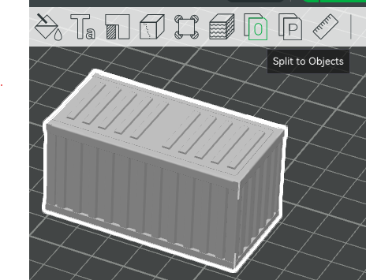
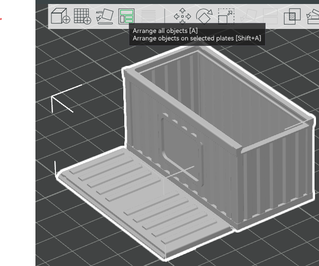
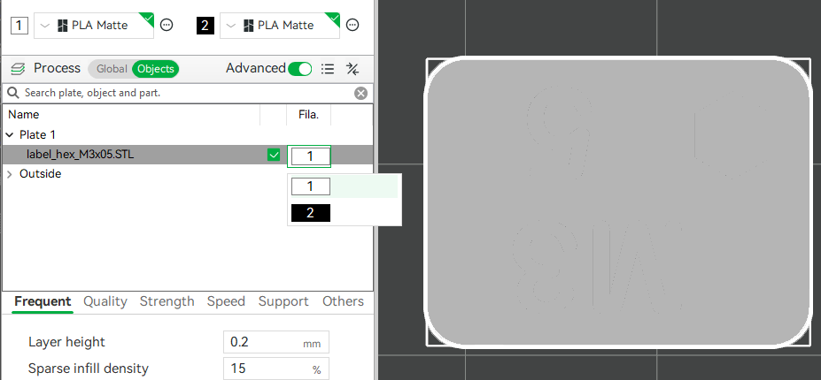
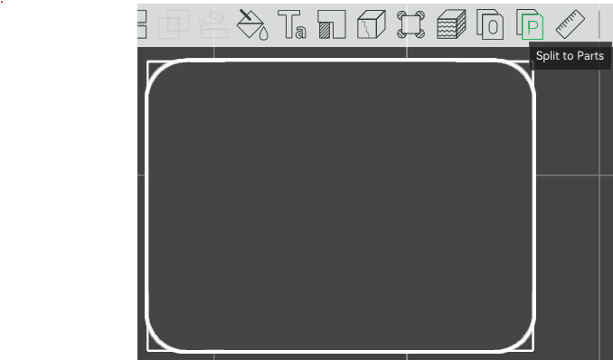
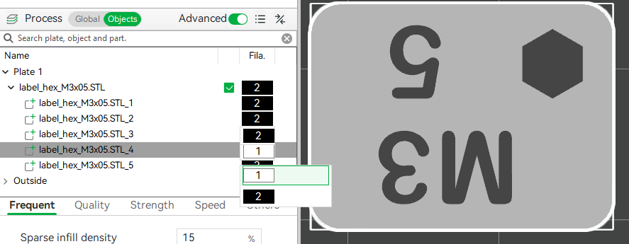

# Simple Guide
This document will show some simple guides on how to work with multibodies models.

Bambu Studio will be the slicer used throughout the entire guide.

## Customized Labels
If you don't like the label design (understandable), you may also draw your own labels.
### Dimension
The dimensions of the side and top labels are shown below.
Side label | Top label
:---: | :---:
 | 

[This folder](./_Label_Instructions/) also provides the SolidWorks files for both types of labels.

### Font
+ Arial Rounded MT is used. Height set as 6.0mm
+ Steps: Put the text to the location you like, extrude-cut the text. Then extrude boss the text with the same sketch without merging the bodies.
+ Smaller or denser texts can be achieved by using smaller nozzles.

## Parameters suggest
+ Layer height: 0.16 mm
+ Brim: outer, 5mm
 
All other parameters can be left as default if no further tuning is required.

## Separating the Lid From the Container
### Steps
+ Import the target model.
+ Click on the "Split to objects" button.
+ Click on the "Arrange all objects" button.

Split to objects | Arrange all objects
:---:|:---:
 | 

## Coloring the labels
+ Import the target label
+ Change the part with the desired text color/filament.
+ Click on the "Split to parts" button. This exposes the bodies within the model without breaking the relationship between bodies.
+ Find the main body of label in the object list. Change the color of the main body.

Change color | Split to parts | Change main body color
:---:|:---:|:---:
 |  | 

## Print Labels without AMS
If you don't have an AMS but want to print the labels, you can split the label into objects and delte the bodies of the texts. Then color the hollow text with paints.

